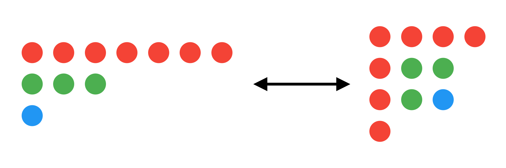

React Partitions
================

[](https://reactjs.org)

**React Partitions** is an upcoming interactive web app where users can animate
bijections of integer partitions with Ferrers diagrams. The web app will be
primarily aimed at applied mathematicians, especially professors and students in
the combinatorics and probability fields. However, it will still be engaging and
fun for people who are not into math! 🙂

Background
----------

This project started off as a 10-week senior math research project under the
supervision of Prof. Stephen DeSalvo in the spring of 2014 at UCLA. The focus
was to create an app which (1) generates random partitions of a given positive
integer *n* such that they have asymptotically *O*(√*n* log *n*) parts with high
probability, and (2) visualizes how certain bijections affect the overall limit
shape of those partitions. The app was originally supposed to be written in C++
using Qt, but it ultimately became a
[Java applet](http://kristorres.weebly.com/partitions.html) instead due to time
constraints.

*React Partitions* is intended to replace that applet, since Java applets were
removed from Java SE 11 in September 2018.

Math Terms: What You Need to Know
---------------------------------

  * A **partition** of positive integer *n*, also called an
    **integer partition** is a way of writing *n* as a sum of positive integer
    parts, which are conventionally in decreasing order. The notation λ ⊢ *n*
    means that λ is a partition of *n*. For example, λ = (3, 2, 2, 2, 1) ⊢ 10.
  * A **Ferrers diagram** represents an integer partition as patterns of dots,
    with the *k*-th row having the same number of dots as the *k*-th part in the
    partition.
  * A **bijection** is a function which is one-to-one and onto.
    * A function *f* with domain *X* is **one-to-one** if for all *a* and *b* in
      *X*, whenever *a* ≠ *b*, then *f*(*a*) ≠ *f*(*b*).
    * A function *f* with domain *X* and codomain *Y* is **onto** if for all *y*
      in *Y*, there is at least one *x* in *X* such that *f*(*x*) = *y*.

Building and Running Locally
----------------------------

```sh
git clone https://github.com/kristorres/react-partitions
cd react-partitions
npm install
npm run build-dev
```

Now go to _build/dev/index.html_ on your favorite browser to view the web app. 😎
